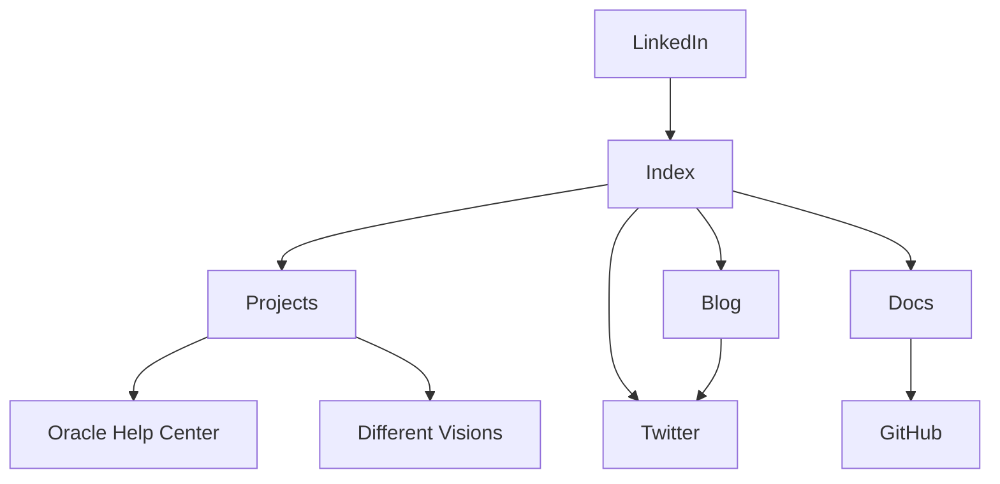

import {Callout, Cards} from 'nextra/components'

# Information Architecture

As I designed my portfolio page, I wanted to present visitors with content in an controlled, elegant way. The navigation component was designed to emphasize my **Projects**, **Blog**, and **Docs**. The **Index** contains an invitation to follow me on **Twitter**.

## A Condensed Flowchart

<Callout>
All sites and pages link to the index. For the sake of clarity, I have omitted some of these connections in the flowchart.
</Callout>




## Contingency Plans

Some key items in my portfolio are hosted on platforms that I don't control. Most of my professional output will be hosted on Oracle Help Center, my academic publication is hosted on the publication's server, and I have opted to publish my blog using Substack. While I think that these platforms are good places to link to this content, I have developed contingency plans to ensure that I don't lose these publications in an emergency.

### Different Visions

I have downloaded a PDF copy of my first academic publication and included in the `public` folder of my Next.js app. If anything ever happens to `differentvisions.org`, I can link to the local copy hosted on my own website.

```
portfolio/
├── app/
├── public/
│   ├── PDFs/
│   ├── ├── homage-to-royer.pdf
│   └── ...
├── package-lock.json
├── package.json
└── ...
```

### Oracle Help Center

To download a PDF copy of an Oracle user guide, complete the following steps:

1. Go to [Oracle Help Center](https://docs.oracle.com/en/industries/health/index.html) and select the user guide that you want to download.
2. From the index page, select any topic.
3. From the navigation menu, select the **Download to PDF** icon. The entire guide is downloaded.

### Substack

Substack 