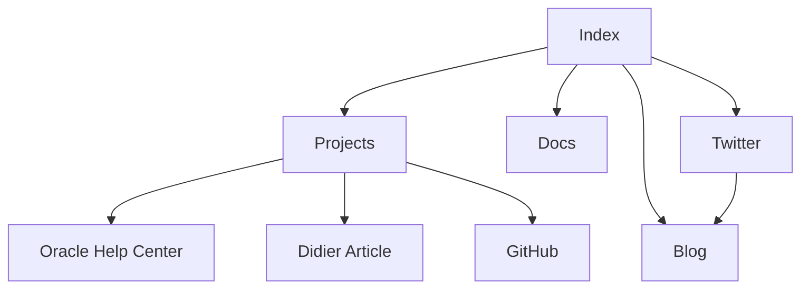

import {Callout, Cards} from 'nextra/components'

# Overview of Information Architecture

The organization of links and information flow for my online presence can be visualized like this.

<Callout>
All sites and pages link to the index. For the sake of clarity, I have omitted these connections in the flowchart.
</Callout>

