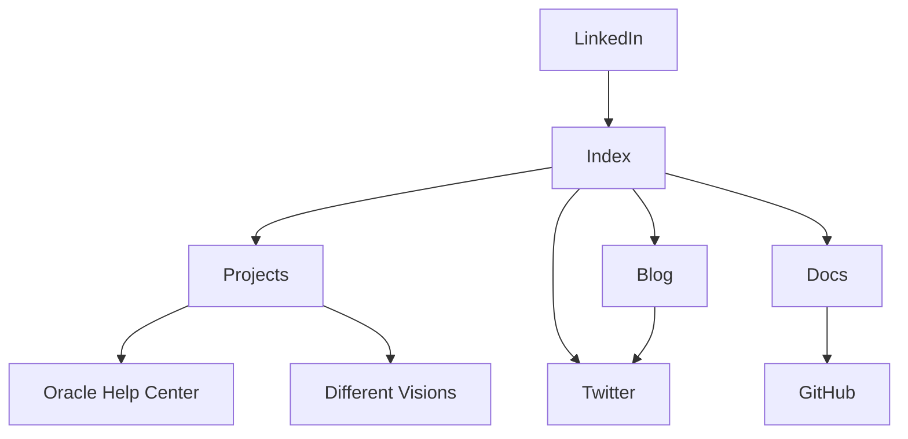

import {Callout, Cards} from 'nextra/components'

# Information Architecture

As I designed my portfolio page, I wanted to present visitors with content in an controlled, elegant way. The [`NavBar`](./components/navbar) component was designed to emphasize my **Projects**, **Blog**, and **Docs**. The **Index** contains an invitation to follow me on **Twitter**.

## A Condensed Flowchart

<Callout>
All sites and pages link to the index. For the sake of clarity, I have omitted some of these connections in the flowchart.
</Callout>

