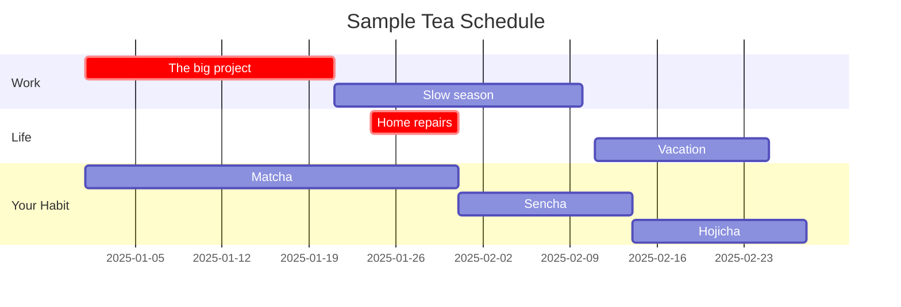

# Manage Your Habit

Now that you know how to select and prepare your tea, you now must grapple with your newfound addiction. Green tea is generally safe and unlikely to cause any serious health problems. Tea, does, however, contain caffeine—an addictive substance.[^1]

## Managing Sleep Disturbances

It takes about ten hours for caffeine to completely exit your system.

## Managing Tolerance

Frequent users of caffeine often complain of increasing tolerance. Over time, you will need to drink more tea to achieve the same effect. A popular strategy way to mitigate this issue is to taper your caffeine use in cycles.[^2] The chart below outlines an example of how you might balance your green tea habit with your work and life.

These pages will teach you how to make green tea.

[^1]: [Caffeine Use Disorder: A Comprehensive Review and Research Agenda](https://pmc.ncbi.nlm.nih.gov/articles/PMC3777290/)
[^2]: [Retaining full effect of coffee and preventing tolerance](https://www.reddit.com/r/Coffee/comments/7dcuse/retaining_full_effect_of_coffee_and_preventing/)