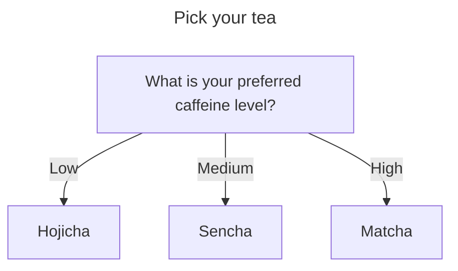

import {Tabs} from 'nextra/components'

# Select Your Tea

These pages will teach you how to make green tea.

## Varieties of Green Tea

Not all green tea is the same. You can choose from a wide variety of green teas that have been grown and processed under different conditions. Each variety has a unique taste and chemical profile. These pages focus on a few varieties of Japanese green tea. Select the tabs below to learn more.

<Tabs items={['Hojicha', 'Sencha', 'Matcha']}>
  <Tabs.Tab>
    

        
    

  </Tabs.Tab>
  <Tabs.Tab>
    

        
    

  </Tabs.Tab>
  <Tabs.Tab>
    

        
    

  </Tabs.Tab>
</Tabs>

## Green Teas by Caffeine Level

